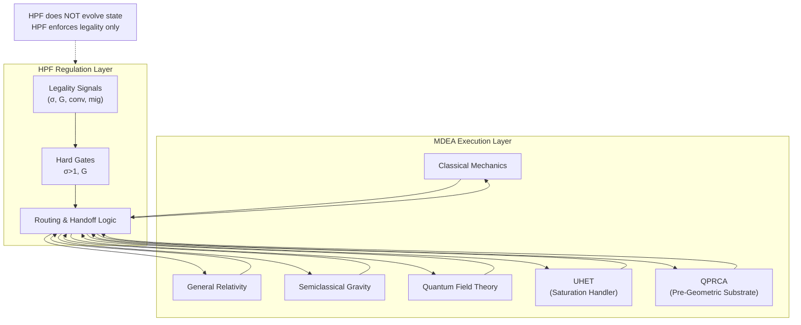

```mermaid
flowchart TB

    %% Core Layers
    subgraph Execution["MDEA Execution Layer"]
        CL["Classical Mechanics"]
        GR["General Relativity"]
        SC["Semiclassical Gravity"]
        QFT["Quantum Field Theory"]
        UHET["UHET\n(Saturation Handler)"]
        QPRCA["QPRCA\n(Pre-Geometric Substrate)"]
    end

    subgraph Regulation["HPF Regulation Layer"]
        SIG["Legality Signals\n(σ, G, conv, mig)"]
        GATE["Hard Gates\nσ>1, G<Gcrit"]
        ROUTE["Routing & Handoff Logic"]
    end

    %% Flow
    CL --> ROUTE
    GR --> ROUTE
    SC --> ROUTE
    QFT --> ROUTE
    UHET --> ROUTE
    QPRCA --> ROUTE

    SIG --> GATE --> ROUTE

    ROUTE --> CL
    ROUTE --> GR
    ROUTE --> SC
    ROUTE --> QFT
    ROUTE --> UHET
    ROUTE --> QPRCA

    %% Notes
    HPFNOTE["HPF does NOT evolve state
HPF enforces legality only"]
    HPFNOTE -.-> Regulation
```
